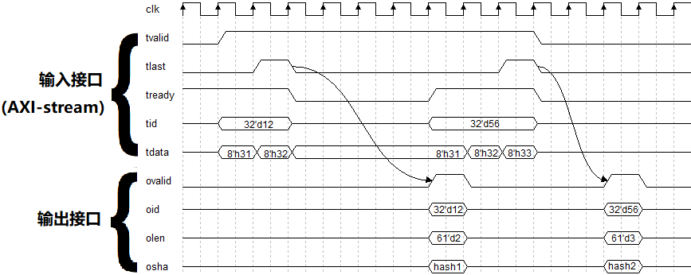

-9A90FD.svg)   

[English](#en) | [中文](#cn)

　

Verilog SHA Family
===========================

Calculate SHA1/SHA224/SHA256/SHA384/SHA512 using FPGA.

　

# Source File List

| Folder | File Name | Discription       | remark                                                       |
| :----: | :-------- | :---------------- | :----------------------------------------------------------- |
|  RTL   | sha1.v   | SHA1 Calculator   | Synthesizable                                                |
|  RTL   | sha224.v | SHA224 Calculator | Synthesizable                                                |
|  RTL   | sha256.v | SHA256 Calculator | Synthesizable                                                |
|  RTL   | sha384.v | SHA384 Calculator | Synthesizable                                                |
|  RTL   | sha512.v | SHA512 Calculator | Synthesizable                                                |
|  SIM   | tb_sha.v | Testbench         | Read files from [SIM/test_data](./SIM/test_data) , send the data in file to above modules to calculate sha1, sha224, sha256, sha384, and sha512. |

　

# Module Usage

These various SHA calculators use a unified, standard AXI-stream interface to input the data stream to be calculated. For example, if you want to calcuate the SHA value of the strings '12' and '123' respectively, you should do the following waveform diagram.

> Note: The ASCII codes of characters '1', '2', '3' are 8'h31, 8'h32, 8'h33 respectively

|  |
| :---------------------: |
|    **图1** : 波形图     |

Notice:

* The module generates one SHA value for each data stream.
* Each data stream must end with `tlast=1`, that is, send the last byte of the data stream with `tlast=1` .
* `tvalid=1` means that the user wants to input a byte to it, so when `tvalid=1`, there must be valid data on `tdata` simutinously.
* Although each byte in the data stream is input continuously in the above waveform diagram, we do not require this. You can add bubbles to the input data stream, that is, let `tvalid=0`, which is equivalent to no input data at this time. (idle for one cycle).
* When `tready=0`, the module is not ready to accept a byte. Only when `tvalid=1` and `tready=1` at the same time, the byte on `tdata` can be accept.
* Whenever a data stream input is completed, that is, starting from the next cycle of `tlast=1`, `tready` will keep several cycles=0. The rest of the time `tready=1`.
* Whenever a data stream input is completed, after several cycles, `ovalid` will generate a cycle of 1. At this time, the SHA value can be read from `osha`, and the data length can be read from `olen`.
* No need to wait until `ovalid=1` to input the next data stream, just wait until `tready=1` to input the next data stream.
* `tid` is a user-defined data stream identifier, which is used to correspond the input data stream and the output hash value. While inputting the first byte of the data stream, an identifier can be output in `tid`, then the identifier Will be output on oid along with the SHA value.

　

# RTL Simulation

Simulation related files are in the [SIM](./SIM) directory:

tb_sha.v is the simulation source, it will read the files in [SIM/test_data](./SIM/test_data) and send all the bytes in the files to SHA calculators. The SHA1, SHA224, SHA256, SHA384, SHA512 result will be printed.

Before using iverilog for simulation, you need to install iverilog , see: [iverilog_usage](https://github.com/WangXuan95/WangXuan95/blob/main/iverilog_usage/iverilog_usage.md)

Then double-click the .bat file to run the simulation (just for Windows). During simulation, the SHA value of each file is printed. After the simulation, you can open the generated waveform file dump.vcd to view the waveform.

　

# Resource Usage

The table below shows the synthesize results on **Xilinx Artix-7 xc7a35ticsg324-1**.

|   Module   | LUT Usage | LUT % | FF Usage | LUT % |
| :--------: | :-------: | :---: | :------: | :---: |
|  **sha1**  |    759    | 3.7%  |   1820   | 4.4%  |
| **sha224** |   1284    | 6.2%  |   2149   | 5.2%  |
| **sha256** |   1284    | 6.2%  |   2149   | 5.2%  |
| **sha384** |   2350    | 11.3% |   3734   | 9.0%  |
| **sha512** |   2350    | 11.3% |   3734   | 9.0%  |

　

　

　

　

Verilog SHA Family
===========================

使用 FPGA 计算 SHA1/SHA224/SHA256/SHA384/SHA512

　

# 代码文件一览

| 所在目录 | 文件名称 | 描述    | 备注   |
| :---: | :--- | :--- | :--- |
| RTL | sha1.v | SHA1 计算模块 | 可综合 |
| RTL | sha224.v | SHA224 计算模块 | 可综合 |
| RTL | sha256.v | SHA256 计算模块 | 可综合 |
| RTL | sha384.v | SHA384 计算模块 | 可综合 |
| RTL | sha512.v | SHA512 计算模块 | 可综合 |
| SIM | tb_sha.v | Testbench       | 读取SIM/test_data中的文件，将文件的数据发送给上述模块，计算并打印 SHA 值 |

　

# 使用方法

这些不同的 SHA 计算器使用统一的，标准的 AXI-stream 接口来输入待计算的数据流。例如，你想分别计算字符串 '12' 和 '123' 的哈希值，则应按照如下波形图进行操作。

> 注意：字符 '1', '2', '3' 的 ASCII 码分别是 8'h31, 8'h32, 8'h33

|  |
| :----: |
| **图1** : 波形图 |

注意：

* 模块会针对每个数据流计算一个 SHA 值。
* 每个数据流必须以 tlast=1 结尾，也就是说，在发送一个数据流的最后一个字节的同时要让 tlast=1 。
* tvalid=1 时，说明外界想输入一个字节给它，所以 tvalid=1 的同时 tdata 上要有有效数据。
* 虽然以上波形图中，数据流中的各个字节是连续输入的，但我们并不要求这样，你可以在输入数据流中加入气泡，也就是让 tvalid=0，此时相当于没有输入数据（空闲一个周期）。
* tready=0 时，说明模块还没有准备好接受一个字节。只有 tvalid 和 tready 同时 =1 时，tdata上的字节才能被接收，下周期才能发送下一个字节。
* 每当一个数据流输入完成后，也就是从 tlast=1 的下一周期开始，tready才会保持若干个周期=0。其余时候 tready=1。
* 每当一个数据流输入完成后，经过若干周期后，ovalid 会产生一周期的1，此时可以从 osha 中读出哈希值，同时可以从olen中读出数据长度。
* 不需要等到 ovalid=1 后再输入下一个数据流，只需要等到 tready=1 时，就能输入下一个数据流。
* tid 是允许用户自定义的数据流标识，用于将输入数据流和输出的哈希值对应起来，在输入数据流的第一个字节的同时，可以在 tid 输出一个标识，则该标识会在 oid 上与哈希值一同输出。

　

# 仿真

仿真相关的文件都在 SIM 目录中：

仿真代码 tb_sha.v 会读取 SIM/test_data 中的文件，并将文件中的所有字节发送给 SHA 计算模块，针对每个文件计算出 SHA1, SHA224, SHA256, SHA384, SHA512 值。

使用 iverilog 进行仿真前，需要安装 iverilog ，见：[iverilog_usage](https://github.com/WangXuan95/WangXuan95/blob/main/iverilog_usage/iverilog_usage.md)

然后双击 .bat 文件来运行仿真 (仅适用于Windows)。仿真的过程中会打印各文件的 SHA 值。仿真结束后，可以打开生成的波形文件 dump.vcd 来查看波形。

　

# 资源占用

下表展示了在 **Xilinx Artix-7 xc7a35ticsg324-1** 上的综合结果。

| 模块名称 | LUT占用量 | LUT百分比 | FF占用量 | LUT百分比 |
| :-----: | :-----:   | :-----:      | :-----: | :-----:      |
| **sha1**    | 759  | 3.7%  | 1820 | 4.4% |
| **sha224**  | 1284 | 6.2%  | 2149 | 5.2% |
| **sha256**  | 1284 | 6.2%  | 2149 | 5.2% |
| **sha384**  | 2350 | 11.3% | 3734 | 9.0% |
| **sha512**  | 2350 | 11.3% | 3734 | 9.0% |

